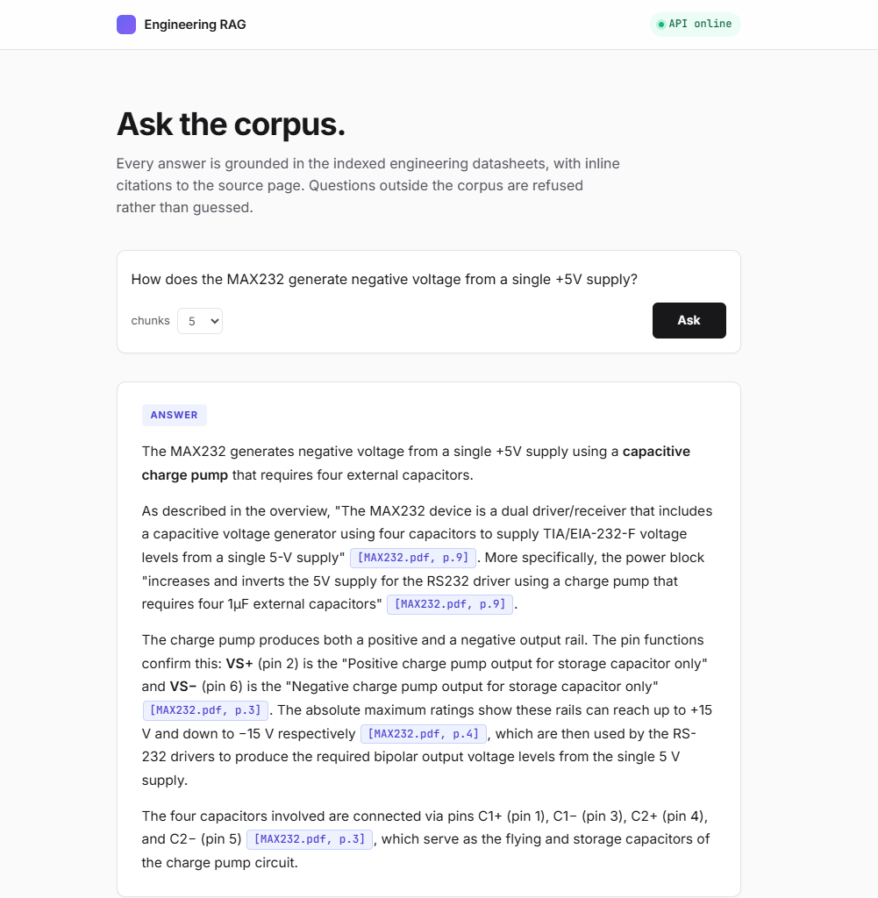
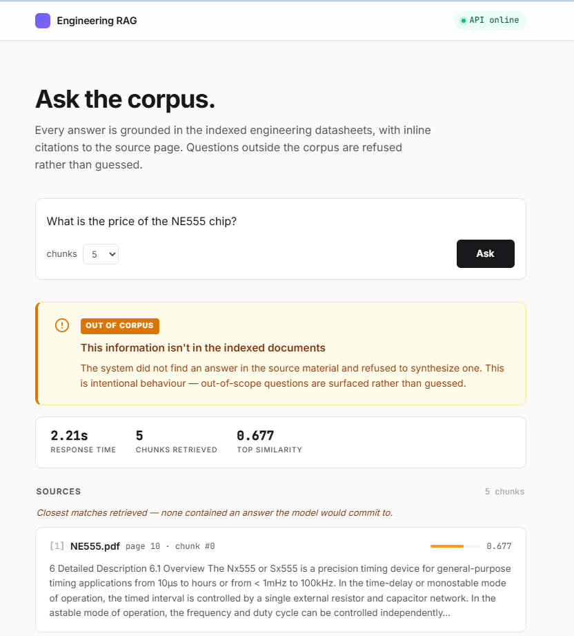

# Engineering RAG Assistant

> A RAG-based assistant that answers engineering questions strictly from
> indexed source documents — built as a full-code reimplementation of a
> Custom GPT solution I previously deployed as a systems engineer working
> in regulated environments (medical, defense).

The system ingests engineering PDFs (datasheets, standards, design
guides), indexes them in a local vector database, and answers natural
language questions against the corpus using Claude. Two principles
shape every design choice:

1. **Every factual claim is cited inline** — `[filename, p.PAGE]` — so
   the answer can always be traced back to the source.
2. **Questions outside the corpus are refused, not guessed** — when the
   indexed documents don't contain an answer, the system responds with
   an exact, deterministic refusal phrase rather than synthesising one
   from the model's general knowledge.

In a regulated environment a hallucinated specification is worse than
no answer at all. The refusal behaviour is the load-bearing feature,
not a fallback.

---

## Screenshots


*Cited answer — every claim links to its source page.*


*Out-of-corpus refusal — the system declines rather than hallucinating.*

---

## Architecture

```
[Ingestion - offline]
  PDFs -> pypdf -> sentence-aware chunking (500 tokens / 50 overlap)
       -> bge-small-en-v1.5 embeddings (384-dim, local)
       -> Qdrant collection: engineering_docs (cosine distance)

[Query - online]
  question -> embed query -> Qdrant top-k search
           -> build prompt with [filename, p.PAGE] source headers
           -> Claude Sonnet 4.6 (anti-hallucination system prompt)
           -> answer with inline citations + source list
```

The ingestion and query pipelines are intentionally separate code paths
— ingestion runs once and can be expensive; query runs on every request
and must be fast. Files in `src/` follow the same split: `ingest.py` and
`chunking.py` are offline; `retrieval.py`, `generate.py`, and `api.py`
are online; `embeddings.py` and `vectorstore.py` are shared seams.

---

## Stack

| Component | Choice | Why |
|---|---|---|
| Language | Python 3.11+ | Type hints, modern syntax, broad ML ecosystem |
| LLM | Anthropic Claude Sonnet 4.6 | Strong instruction-following for the citation/refusal rules; `temperature=0.0` for determinism |
| Embeddings | `BAAI/bge-small-en-v1.5` via sentence-transformers | Local, 384-dim, no external dependency, zero per-query cost, fully offline — critical for confidential corpora |
| Vector DB | Qdrant in Docker | Production-grade (not a toy library), real dashboard at `:6333/dashboard`, containerised for repeatable deployment |
| Backend | FastAPI + Pydantic | Typed request/response models, auto-generated OpenAPI docs at `/docs` |
| Frontend | Vanilla HTML / CSS / JS in `frontend/` | Served by FastAPI at the same origin as the API — no build step, no framework runtime, no CORS plumbing. Streamlit version retained in `app.py` as a secondary option. |
| Orchestration | docker-compose | Brings up Qdrant with a persistent volume — re-runs don't lose the index |

---

## Frontend

A single-page UI in vanilla HTML, CSS, and JavaScript — no build step
and no framework runtime. It lives in `frontend/` and is served by
FastAPI at the same origin as the API, so there is no CORS
configuration to maintain.

Key UI behaviour:

- **Cited answers as inline badges.** `[NE555.pdf, p.1]` references in
  the answer are rendered as clickable indigo badges; activating one
  smooth-scrolls to the matching source card and pulses it briefly.
- **Source cards with similarity scores.** Each retrieved chunk is
  shown as its own card with a horizontal score bar (green / amber /
  red tiers) and a snippet preview.
- **Refusal banner for out-of-corpus questions.** When the model emits
  the refusal phrase, the UI swaps the answer card for an amber banner
  labelled "OUT OF CORPUS" — signalling that the refusal is intentional
  behaviour, not a failure.
- **Live query metrics.** After every request, a strip shows response
  time, chunks retrieved, and top similarity score, so the system's
  observability is visible to the user, not hidden behind a console.
- **API status pill.** A health check on page load renders a green
  "API online" pill in the top bar, or a red "API offline" pill with a
  hint to start the backend.

The design uses Inter (Google Fonts), a single indigo accent, and a
CSS custom-property token system for colours, spacing, and shadows.

---

## Engineering Decisions

These are the decisions I'd defend in a technical interview, with
reasoning.

### 1. Chunk size 500 tokens, 50-token overlap, sentence-aware

Chunks are packed greedily by sentence so each chunk is a coherent
quote. 500 tokens fits inside the bge-small-en-v1.5 model's 512-token
maximum sequence length, guaranteeing no silent truncation by the
embedding model. The 10% overlap (50 tokens) preserves cross-chunk
context for ideas that span a paragraph boundary without bloating the
index with near-duplicates. Token counts are estimated from word counts
using the standard English heuristic (~1.3 tokens per word) — accuracy
is sufficient for chunking decisions and avoids loading a tokenizer
just for the count.

### 2. Defense-in-depth against hallucination

Three concurrent guards, none sufficient on its own:

- **System prompt** explicitly forbids using general knowledge, even
  when the model is confident.
- **User prompt** presents each chunk under a header (`--- [filename,
  p.PAGE] ---`) that the model is told to copy verbatim into citations.
  This eliminates the failure mode where the model paraphrases the
  filename or invents a page number.
- **Explicit verbatim refusal phrase** — `"I don't have information on
  this in the provided documents."` — for out-of-corpus questions. The
  evaluation set verifies the model emits this exact string.

In the eval, refusal precision is 4/4 — measured, not assumed.

### 3. Local embeddings over hosted (Voyage AI / OpenAI)

Trade-off accepted explicitly: bge-small-en-v1.5 produces 384-dim
vectors (vs. 1024 for voyage-3) and is English-only. The wins justify
the cost: zero external dependency, zero per-query cost, fully offline
inference. For engineering documents that are often subject to
confidentiality constraints (medical, defense), no data leaves the
machine. A hosted model would marginally improve recall but would
change the deployment story entirely.

### 4. Qdrant in Docker over embedded vector stores

Embedded libraries (Chroma, in-memory FAISS) are easier to start with
but signal "toy project" to a reviewer. Qdrant runs as a real service
with its own dashboard, persistence, and operational model — closer to
how this would actually be deployed. The dashboard at
`localhost:6333/dashboard` also gave me real-time visibility into the
collection state during development, which surfaced an entire class of
bugs (see "Built with Claude Code" below).

### 5. Tables and figures: known limitation, not a bug

`pypdf` extracts datasheet tables as concatenated text streams — rows
merged, columns lost. I chose not to add OCR or a table-parsing
library: those tools introduce their own failure modes and would
compromise the "extracted text is high fidelity" assumption that the
chunker relies on. Instead, table-heavy pages still produce chunks
(they're not lost), but they're acknowledged in the evaluation as an
area where the system underperforms. Future work would add a
table-aware extractor like `pdfplumber` or `Camelot` specifically for
electrical-characteristics tables.

---

## Evaluation Results

| Metric | Value |
|---|---|
| Overall accuracy | **16 / 16 (100%)** |
| In-corpus questions | 12 / 12 (100%) |
| Refusal precision | 4 / 4 (100%) |
| Avg. response time | 4.5 s per query |

The eval set lives in `eval/test_questions.json` — 12 in-corpus
questions distributed evenly across four datasheets (NE555, LM358,
MAX232, INA128), plus 4 out-of-corpus questions (price, inventor,
market data, manufacturing process) that should all be refused.

Each in-corpus question is verified for: (a) required keywords present
in the answer, (b) the expected source either cited inline or returned
as the top-1 retrieval result, (c) no spurious refusal. Each
out-of-corpus question is verified for the verbatim refusal phrase.

The set is calibrated to factual claims that appear on early datasheet
pages (supply ranges, device category, component counts). Numerical
precision questions ("What is the CMRR in dB?") and cross-document
comparisons would degrade this score and are tracked as future work.

Run the eval with:

```bash
python eval/run_eval.py
```

---

## Built with Claude Code

The full system was developed iteratively with Claude Code acting as
an agentic coding partner. Each task — scaffolding, ingestion, vector
store, prompts, API, evaluation — was generated by the agent and then
validated by hand before moving on. The validation discipline caught
real issues, two of which are worth recording:

**Verified success vs. reported success.** Mid-project, the UI was
empty even though the build pipeline appeared to have completed.
I suspected the Qdrant client had fallen back to embedded/local mode
instead of connecting to the Docker container. Diagnostics — `docker
ps`, a direct `curl http://localhost:6333/collections`, a filesystem
scan for local artifacts — showed the container was healthy, the HTTP
API was reachable, and no local database files existed. The actual
issue was different: the agent had described the pipeline as if it had
run, but the script had never actually executed in the current session.
The "success" was a forward-looking statement, not a verified result.
The lesson generalises: agent-reported success is not equivalent to
verified success. From that point on, I treated every claim of
"pipeline complete" as a hypothesis to confirm against the underlying
system, not the agent's narration.

**Decoupling environment problems from product problems.** Halfway
through, an unrelated plugin's Stop hook started failing on every
keystroke with `Python was not found` (a Windows / Microsoft Store stub
issue). The right call wasn't to debug the plugin — it wasn't part of
the project. I disabled the plugin in `~/.claude/settings.json` and
moved on. Choosing which obstacles to solve and which to bypass is
part of the work.

---

## Running the System

### Prerequisites
- Python 3.11+
- Docker (for Qdrant)
- An Anthropic API key

### One-time setup

```bash
pip install -r requirements.txt
cp .env.example .env             # then fill in ANTHROPIC_API_KEY
docker compose up -d             # starts Qdrant on localhost:6333
python scripts/download_samples.py   # pulls 4 sample TI datasheets into data/
python scripts/build_index.py        # ingests + embeds + stores in Qdrant
```

### Running the application

A single command brings up both the API and the UI on the same port:

```bash
uvicorn src.api:app --port 8010
```

Then open <http://localhost:8010> in a browser.

URLs:
- UI: <http://localhost:8010>
- API docs (Swagger): <http://localhost:8010/docs>
- Qdrant dashboard: <http://localhost:6333/dashboard>

**Optional — Streamlit UI.** A Streamlit version is retained in
`app.py` as a secondary option (useful for environments where the
static frontend is inconvenient). Run it with `streamlit run app.py`;
it talks to the same FastAPI backend.

### Command-line query (without UI)

```bash
python scripts/ask.py "How does the MAX232 generate negative voltage from a single +5V supply?"
```

### Running the evaluation

```bash
python eval/run_eval.py
```

---

## Limitations and Future Work

Honest about what isn't there yet.

**Known limitations**
- **Tables in datasheets** lose row/column structure under `pypdf`'s
  text extraction. Electrical-characteristics tables appear in chunks
  as flattened text streams.
- **Numerical-precision questions** are under-tested. The eval set
  deliberately avoids them — adding them is expected to lower the
  score and surface real failure modes.
- **English only** — bge-small-en-v1.5 is monolingual. Hebrew or
  multilingual corpora would require `bge-m3` (1024-dim, larger).
- **Single-pass retrieval, no re-ranking.** Irrelevant chunks can
  occasionally pollute the top-k context (observed: an INA128 chunk
  appearing for a MAX232 question). The LLM filtered it correctly via
  the citation rule, but a re-ranker would prevent the pollution
  upstream.

**Planned upgrades**
- **Cross-encoder re-ranking** of retrieval results (`bge-reranker-base`
  or similar) to filter context pollution before it reaches the LLM.
- **Hybrid search** combining dense vectors with BM25 for queries
  dominated by exact terms (part numbers, standards numbers, pin
  designators).
- **Streaming responses** in the UI for ChatGPT-style perceived
  latency (token-by-token rendering as Claude generates).
- **Table-aware extraction** with `pdfplumber` for electrical-
  characteristics tables specifically.
- **Eval set expansion** to include numerical-precision questions,
  cross-document comparisons, and ambiguity tests.
